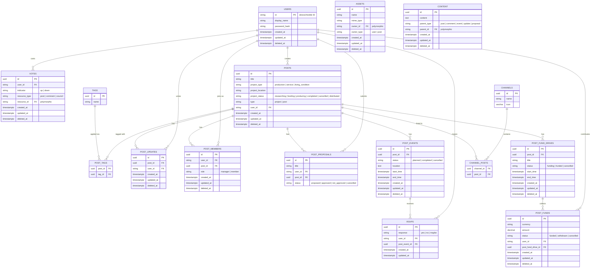
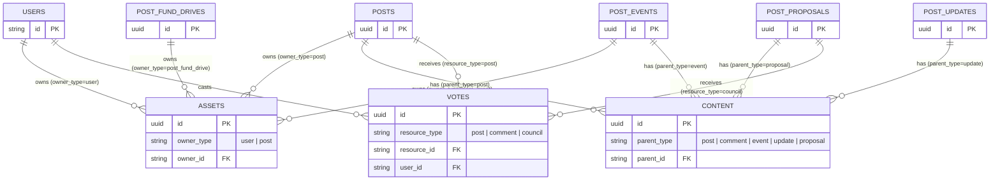

# Social Production Data

## Database Schema and Relationships

### Diagrams

#### Entity Relationship Diagram

#### Polymorphic Associations

These three tables use `type`/`id` pairs to associate with multiple parent entities.

### Users

- Have
  - An ID using the computer or mobile device ID
  - A display name
  - A password hash
  - A created at timestamp with time zone
  - An updated at timestamp with time zone
  - A deleted at timestamp with time zone

### Assets

- Have
  - An ID using UUID
  - A name
  - An application mime type
  - An owner ID
  - An owner type (user, post)
  - A created at timestamp with time zone
  - An updated at timestamp with time zone
  - A deleted at timestamp with time zone

### Content

- Have
  - An ID using UUID
  - A content field using text
  - A parent type (post, comment, event, update, proposal)
  - A parent ID
  - A created at timestamp with time zone
  - An updated at timestamp with time zone
  - A deleted at timestamp with time zone

### Votes

- Have
  - An ID using UUID
  - A user ID
  - An indicator (up, down)
  - A resource type (post, comment, council)
  - A resource ID
  - A created at timestamp with time zone
  - An updated at timestamp with time zone
  - A deleted at timestamp with time zone

### Tags

- Have
  - An ID using UUID
  - A name
  - Many posts

### Posts

- Have
  - An ID using UUID
  - A title
  - A project type (production, service, living condition)
  - A project location
  - A project status (researching, funding, producing, completed, cancelled, distributed)
  - A type (project, post)
  - A created at timestamp with time zone
  - An updated at timestamp with time zone
  - A deleted at timestamp with time zone
  - Many assets
  - Many votes
  - One content
  - A user ID
  - Many tags

### Post Updates

- Have
  - An ID using UUID
  - A post ID
  - A user ID
  - One content
  - A created at timestamp with time zone
  - An updated at timestamp with time zone
  - A deleted at timestamp with time zone

### Post Members

- Have
  - An ID using UUID
  - A user ID
  - A post ID
  - A role (manager, member)
  - A created at timestamp with time zone
  - An updated at timestamp with time zone
  - A deleted at timestamp with time zone

### Post Proposals

- Have
  - An ID using UUID
  - A title
  - A user ID
  - One content
  - Many votes
  - A status (proposed, approved, not approved, cancelled)

### RSVPs

- Have
  - An ID using UUID
  - A response (yes, no, maybe)
  - A user ID
  - A post event ID
  - A created at timestamp with time zone
  - An updated at timestamp with time zone

### Post Events

- Have
  - An ID using UUID
  - A post ID
  - A status (planned, completed, cancelled)
  - A location using text
  - Many RSVPs
  - A created at timestamp with time zone
  - An updated at timestamp with time zone
  - A deleted at timestamp with time zone
  - A start time as a timestamp with time zone
  - An end time as a timestamp with time zone
  - One content
  - Many assets

### Post Funds

- Have
  - An ID using UUID
  - A currency
  - An amount
  - A status (funded, withdrawn, cancelled)
  - A user ID
  - A post fund drive ID
  - A created at timestamp with time zone
  - An updated at timestamp with time zone
  - A deleted at timestamp with time zone

### Post Fund Drives

- Have
  - An ID using UUID
  - A post ID
  - A title
  - A status (funding, funded, cancelled)
  - One content
  - Many assets
  - Many post funds
  - A start timestamp with time zone
  - An end timestamp with time zone
  - A created at timestamp with time zone
  - An updated at timestamp with time zone
  - A deleted at timestamp with time zone

### Channels

- Have
  - An ID using UUID
  - A name
  - An icon using varchar(255)
  - Many posts
