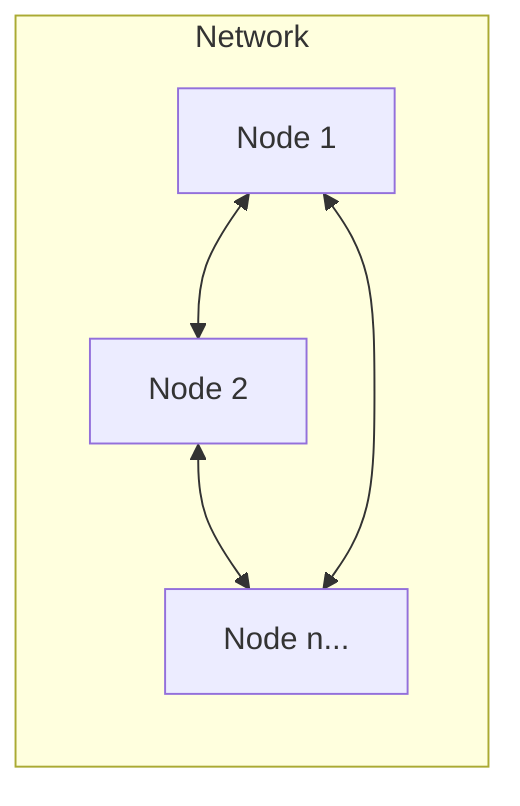
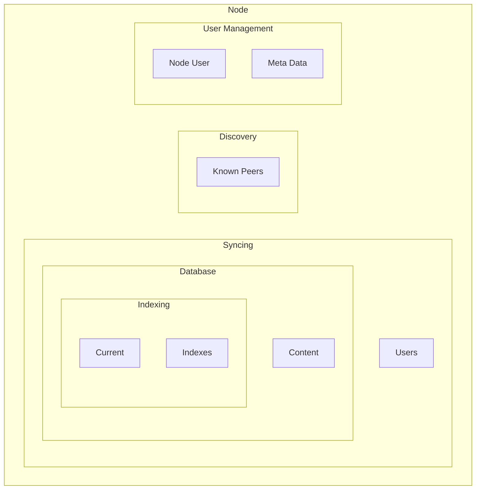
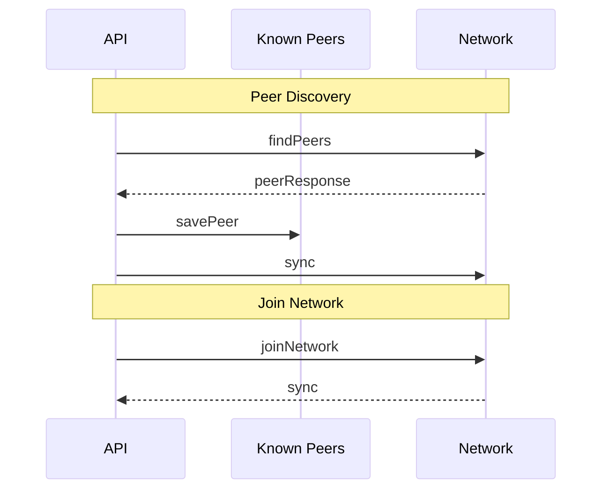
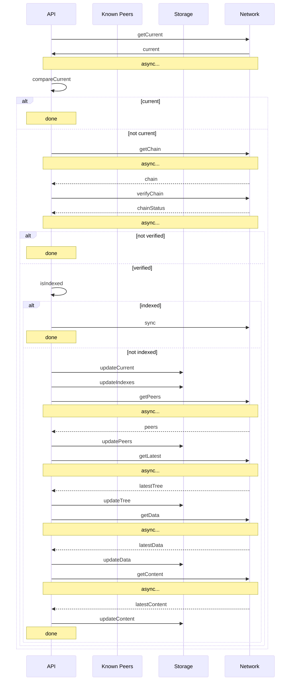

# System Design

This document is meant to describe the system design of Social Production. For the sake of simplicity, it is broken up into Network and Clients portions.

## Network

The network is built as a peer to peer system consisting of nodes.

### Network Feature Processes

- Indexing
- Content
- Discovery
- Syncing
- User Management

#### Indexing

Indexing is the process of keeping track of the content state in a Merkle Tree. This is important to support the syncing process.

#### Content

Content is stored in each node in total. When syncing occurs, the content space grows dependent on what the peers have to upload to a node. That means that demand for data storage can be high.

This is partially dealt with by using data compression algorithms and partially through on demand downloads. This is configurable and dealt with through the node's mode.

#### Discovery

Discovery is the act of finding peers to communicate with. The platform uses Kademlia for remote discovery and MDNS for local discovery.

All discovered peers are stored locally as known peers and won't have to be discovered again.

All known peers are periodically checked for their online status and dropped from know peers if they are no longer online.

#### Syncing

Syncing starts with checking the current index of the node against that of known peers.

If any index is different from the current index, known indexes are checked to see if the node has already downloaded it.

If the index has been downloaded already, a sync pull from the peer will be started and nothing needs to be done.

If the index has not been seen before, then a download is needed.

If a download is needed, the sync process works like this:

1. Download the latest merkle tree from the peer
1. Update the database with the new merkle tree
1. Update the current index from the root hash of the new merkle tree
1. Update indexes with the root hash of the new merkle tree
1. Download known users from the peer

Dependent on the mode of the node, additionally content will be downloaded from the peer.

#### User Management

Depending on the mode of the node, user creation and management can be done. For every mode a user is found and used or created if not found on the node startup. Additional management can be done with the Full and Light modes, such as adding a nick, or other meta data, to the user.

Additionally, a set of known users is tracked to help with social functions such as connecting with a user.

### Network Modes

In order to operate, the network is formed of nodes that use peer to peer technologies. Each node communicates with its peers, but in different modes.

There are 3 modes for a node:

- Full
- Light
- Gossip

Each mode supports different levels of the network feature processes. All nodes report what mode they are running in upon request.

#### Full Mode

In Full mode, the node covers all of the network feature processes.

#### Light Mode

In Light mode, the node supports all of the network feature processes with one caveat:

**Content from peers is never automatically synced**

Instead, content is downloaded on demand. That means that when content is requested, if it isn't already downloaded from previous uses, the node will reach out to its known peers, where the peer is in Full mode, and download it.

If content is created on the node itself, the data will be pushed during a sync as normal.

#### Gossip Mode

In Gossip mode, the only supported features are:

- Indexing
- Discovery
- Syncing (limited)
- User Management

Syncing is limited to syncing everything but the content.

### Diagrams

#### Network

#### Node Stack

#### Discovery Workflow

#### Syncing Workflow

